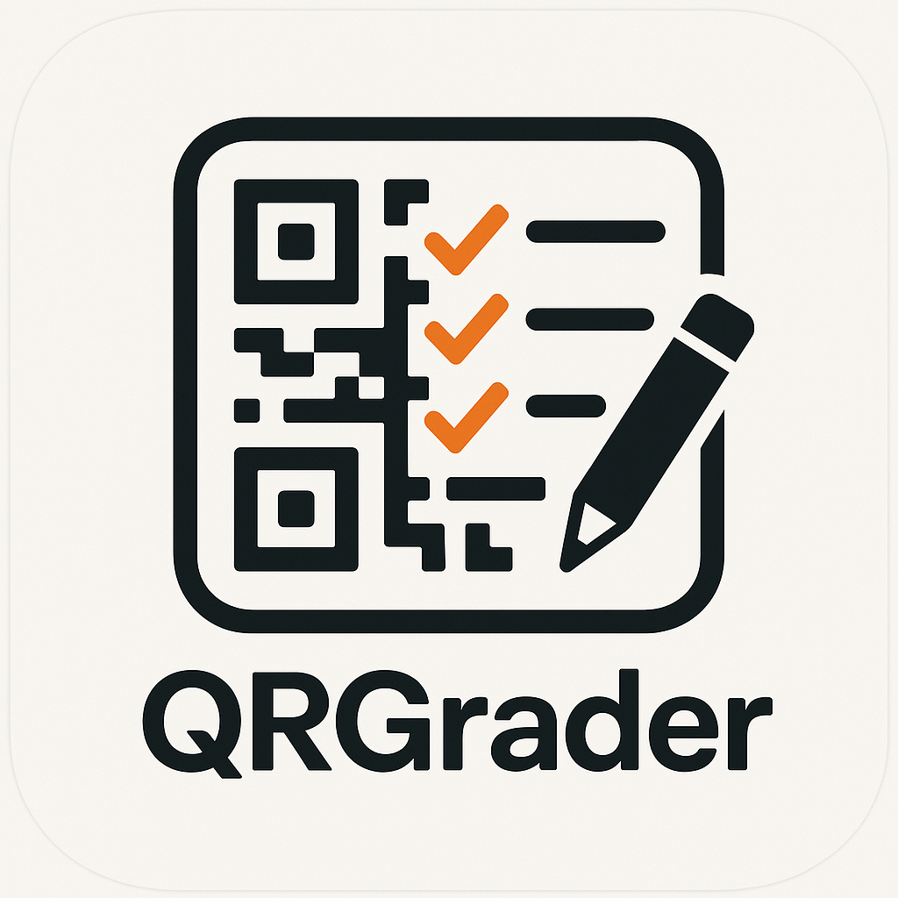
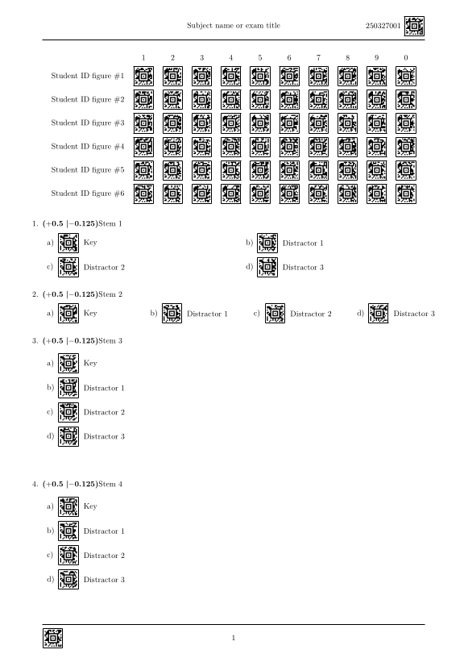
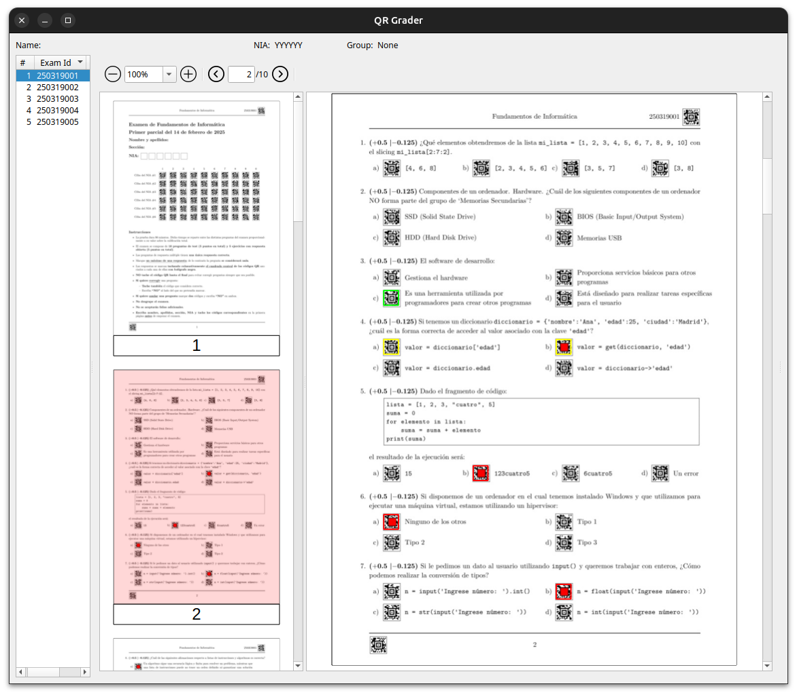
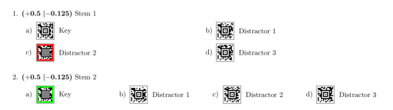

# QRGRADER



## Index

- [Introduction](#introduction)
- [Prerequisites (Linux)](#prerequisites-linux)
- [Prerequisites (Windows)](#prerequisites-windows)
- [Installation](#installation)
    - [Installation from PyPI](#installation-from-pypi)
    - [Installation from source](#installation-from-source)
- [Usage](#usage)
    - [Creating a new workspace](#creating-a-new-workspace)
    - [Preparing the exam](#preparing-the-exam)
    - [Generating the exams](#generating-the-exams)
    - [Grading the exams](#grading-the-exams)
    - [Graphical user interface](#graphical-user-interface)
    - [Annotating the exams](#postprocessing-and-annotating-the-exams)
- [First Exam: Simulation](#first-exam-simulation)
    - [First step: generate the simulated exam](#first-step-generate-the-simulated-exam)
    - [Second step: simulate the exam](#second-step-simulate-the-exam-session-marking-the-exams)
    - [Third step: grading the exams](#third-step-grading-the-exams)
    - [Fourth step: check the results](#fourth-step-check-the-results)
    - [Fifth step: annotate the exams](#fifth-step-postprocess-and-annotate-the-exams)
- [Sharing the workspace](#sharing-the-workspace)
- [CSV files format details](#csv-files-format-details)

## Introduction

QRGrader is a set of scripts that allows you to generate and grade multiple choice exams using QR codes. The script will generate a QR code for each question
and the correct answer. Students can scan the QR code to check their answers. The script will also generate a summary of the results for each question.

This README file is a guide to use the scripts. The scripts are designed to be used in a specific order, so it is important to follow the instructions
carefully.

In the following sections, we will explain how to install and use the scripts, how to generate the exams, how to grade the exams, and how to annotate the exams.

You can also jump to the [First Exam: Simulation](#first-exam-simulation) which is designed to verify that everything is functioning properly. We will simulate
an exam scenario to ensure the scripts perform as expected. Running this test beforehand helps confirm that everything is working correctly before deploying the
scripts in a real exam setting.

QRGrader is a simple python script that allows you to grade
multiple choice questions using QR codes. The script will generate a QR code for each question and the correct answer.
Students can scan the QR code to check their answers. The script will also generate a summary of the results for each
question.

The exam must the prepared in a latex file using the style document provided.

## Prerequisites (Linux)

- Python 3.12
- `texlive-full`

To install `texlive-full` on Ubuntu, run the following command:

```bash
sudo apt install texlive-full
```

## Prerequisites (Windows)

- Python 3.12
- [Miktex](https://miktex.org/)
- [Visual C++ Redistributable for Visual Studio 2015](https://www.microsoft.com/en-us/download/details.aspx?id=48145)
- [Media Feature Pack for Windows](https://support.microsoft.com/en-us/topic/media-feature-pack-list-for-windows-n-editions-c1c6fffa-d052-8338-7a79-a4bb980a700a)

## Installation

### Installation from PyPI

To install the scripts from the Python Packages Index, run the following command:

```bash
$ pip install qrgrader
```

### Installation from source

In this case you need to have `git`already installed. To install the scripts from source, run the following command:

```bash
$ git clone https://github.com/dantard/qrgrading.git
$ cd qrgrader
$ pip install .
```

## Usage

All the script command must be executed inside the so-called qr workspace which is
a directory tree called `qrgrading-DDDDDD` with the following structure:

```

qrgrading-250212
├── config
├── data
├── source
├── generated
├── scanned
├── results
    ├── xls
    ├── pdf

```

### Creating a new workspace

To create a new workspace, run the following command in a terminal:

```bash
$ qrworkspace -c -d 250312
Workspace 'qrgrader-250312' created successfully.
```

Generally, the number is the date of the exam. If the scripts is called
without the `-d` option, the current date will be used.

Once created the workspace, the source directory will contain a file called `qrgrading.sty` which is the style file used to generate the exams and another file
called `main.tex` which is a sample exam that can be personalized according to the needs of the exam.

### Preparing the exam

The following is preparing the exam. The source files must be in the `source` directory.

The exam has the following structure:

```latex
\documentclass[oneside,spanish]{article}
\usepackage[aztec, draft]{qrgrading}
\qrgraderpagestyle{Subject name or exam title}

\begin{document}

    \IDMatrix{0.6cm}{\uniqueid}{Student ID figure}

    \begin{exam}[shuffle=all, style=matrix, showcorrect=no, encode=yes]

        \question[score=0.5, penalty=0.125, brief=first]{1}
        {Stem 1}
        {Key}
        {Distractor 1}
        {Distractor 2}
        {Distractor 3}

%%

        \question[score=0.5, penalty=0.125, brief=second, style=horizontal]{2}
        {Stem 2}
        {Key}
        {Distractor 1}
        {Distractor 2}
        {Distractor 3}

%%

        \question[score=0.5, penalty=0.125, brief=third, style=list]{3}
        {Stem 3}
        {Key}
        {Distractor 1}
        {Distractor 2}
        {Distractor 3}
    \end{exam}
\end{document} 
```

For the moment it is only possible to have four possible answers.

The main file must be called `main.tex`.

The exam environment has the following options:

- `shuffle`: The questions can be shuffled. The options are `all`, `questions`, `answers`, and `none`.
- `style`: The default style of the exam. The options are `matrix`, `horizontal`, and `list`.
- `showcorrect`: Show the correct answers. The options are `yes` and `no`.
- `encode`: Encode the answers in the QR code. The options are `yes` and `no`.

The `question` has six parameters:

- Question number (must be a number and they must be consecutive)
- Stem of the question
- Four answer options (key and distractors)

Its environment has the following options (all are optional):

- `score`: The score of the question.
- `penalty`: The penalty of the question.
- `brief`: A brief description of the question.
- `style`: The style of the question. The options are `matrix`, `horizontal`, and `list`.

Any Latex code that works inside an environment can be used inside the `question` environment. On the other cases, it is useful to prepare the code in a
different file and use the `\input` command inside the `question` environment.

### Generating the exams

To generate the exams run the following command:

```bash
$ qrgenerator -n 10
** Starting parallelized generation (using 4 threads)
Creating exam 250327001 (0 ready)
Creating exam 250327002 (0 ready)
Creating exam 250327003 (0 ready)
Creating exam 250327004 (0 ready)
Creating exam 250327005 (1 ready)
Creating exam 250327006 (2 ready)
Creating exam 250327007 (3 ready)
Creating exam 250327008 (4 ready)
Creating exam 250327009 (5 ready)
Creating exam 250327010 (6 ready)
Done (10 exams generated).
Creating generated.csv file...Done.
Creating questions.csv file...Done.
``` 

Where `-n` is the number `N` of exams to generate.
In this example the `qrgenerator` will generate 10 exams in the `generated` directory in PDF format. Both the order of the questions and the answers will be
different for
each exam. The file name will have the format `DDDDDDNNN.pdf` where `DDDDDD` is the date of the exam
and `NNN` is the number of the exam from `001` to `NNN`, in this case `010`.

They will have the following aspect (naturally, the content can be personalized):



### Marking the exams

The exams must be printed in a normal printer. The students must mark the answers with a pen or a pencil over the QR code. The system is robust and basically
any mark will do.

The only thing that must be taken into account is that the QR code must be marked with a pen or a pencil and the marks must be inside the QR code.

### Grading the exams

Once the students have answered the exam, the exams must be scanned at 400dpi/color with a normal scanner.
The scanned files must be put afterward in the `scanned` directory.
The grading is carried out with the following command:

```bash
$ qrscanner -p
qrscanner -p 
Processing file 250327001.pdf
Processing file 250327002.pdf
Processed /home/danilo/work/qrgrader/qrgrader-250327/scanned/250327001.pdf
Processed /home/danilo/work/qrgrader/qrgrader-250327/scanned/250327002.pdf 
Processed /home/danilo/work/qrgrader/qrgrader-250327/scanned/250327001.pdf 
Processed /home/danilo/work/qrgrader/qrgrader-250327/scanned/250327002.pdf 
Reconstructing exams
All done :)
```

This command will process the PDF files and generate a set of files in the `results` directory.
Specifically, the `results/pdf` directory will contain the reconstructed pdf files named in the same
way as the generated files.

On the other hand, the `results/xls` directory will contain the results in a set of
csv files as follows:

- `DDDDDD_questions.csv`: A file in which each row contains information about the questions (actually generated by ```qrgenerator```during the generation
  step)

### Graphical user interface

Sometimes, students mark an answer, and later they want to modify that answer.
Since it is impossible to erase the QR code, in these cases they are instructed to mark  
also the chosen answer and write "NO" beside the answer they want to erase.
It will result in a question with two marked answers that can be easily identified.
To facilitate the grading of these cases, we created a graphical user interface that allows unmarking the answer that has been marked by mistake.
To use the graphical user interface, run the following command from within the workspace directory

```bash
$ qrgrader
```

The graphical user interface will open as follows:


On the left side the exam number is shown, and the PDF file is displayed on the right side.
The marked answers are shown in green and red. When a question has two marks,
both answers are shown in yellow. Double-clicking on the answer will unmark it and show the change in cyan.


### Postprocessing and annotating the exams

Once all the double marks have been removed, the exams can be postprocessed and annotated to show
the correctly and incorrectly marked answers in the PDF itself that can be given to the students as a feedback. To do this, run the following command:

```bash
$ qrscanner -q
>> Creating DDDDDD_nia.csv file
>> Creating DDDDDD_raw.csv file
>> Creating DDDDDD_table.csv file
>> Annotating exams
   Annotating exam 15
All done :)
```

This will annotate the PDF files in the `results/pdf` directory with the correct and incorrect answers. The questions will be marked in green and red,
respectively as follows:



Also, it will create a few new files in the `results/xls` directory:
- `DDDDDD_raw.csv`: A file in which each row contains the exam number, and a set of `1 and `0` and values organized in group of
  4 that represent whether the student has marked a specific question
- `DDDDDD_nia.csv`: A file in which each row contains the exam number and the student ID
- `DDDDDD_table.csv`: A Google-sheet compatible file that contains the results of the exam in a table format; it includes all the questions and the
  answers marked by the students, as well as the correct answers and the scores for each question and the formulas to compute the grades. This is the only file needed for a basic grading of the exams.

## First Exam: Simulation

To check that everything is working correctly, you can run the whole process on a simulated exam.

### First step: generate the simulated exam

Since when the `qrworkspace` is created, a bogus `main.tex` and `qrgrading.sty` files are created, you can run the following command to generate a simulated
exam:

```bash
$ qrworkspace -d 250312
$ Workspace 'qrgrader-250312' created successfully.
```

As commented earlier, the `qrworkspace` command will create a directory called `qrgrading-250312`.

Change to the `qrgrading-250312` directory by running the following command:

```bash
$ cd qrgrader-250312
```

Then, you can run the following command to generate ten bogus exams:

```bash
$ qrgenerator -n 10
```

This will generate 10 exams in the `generated` directory.

### Second step: simulate the exam session: marking the exams

Now, it is possible to use the qrscanner application to randomly mark these exams and copy them into
the scanned directory as if they were scanned exams. This can be done as follows:

```bash
$ qrscanner -S 10
```

This will create 10 randomly marked exams in the `scanned` directory.

### Third step: grading the exams

Now, you can run the grading process as follows:

```bash
$ qrscanner -p
```

This will process the scanned exams and generate the results in the `results` directory.

### Fourth step: check the results

Subsequently, you can run the graphical user interface to check the results:

```bash
$ qrgrader
```

With the interface you can unmark the hypothetical double marks.

### Fifth step: postprocess and annotate the exams

Once done, can postprocess and annotate the exams with the correct and incorrect answers as follows:

```bash
$ qrscanner -q
```

and you are done!

# Sharing the workspace


## Overview

`qrworkspace` is a command-line tool designed for managing QRGrader exam workspaces and keeping them synchronised with Google Drive. It provides a complete workflow for the full lifecycle of an exam grading session: creating a fresh local workspace with all the necessary structure and templates, uploading it to a shared Google Drive folder so that collaborators can access it, cloning an existing remote workspace onto a new machine, and pushing or pulling incremental changes as work progresses.

The tool is built around a permission system that allows workspace administrators to control exactly which collaborators can modify which parts of the workspace, making it well suited to multi-user grading scenarios where different people are responsible for different sections of an exam.

---

## Authentication

The first time `qrworkspace` connects to Google Drive, it will ask you to enter a password in order to decrypt the bundled client secret. This password is not stored anywhere on disk and must be entered manually on first use. To obtain the password, please contact **dantard@unizar.es**.

Once you have entered the correct password, `qrworkspace` writes the decrypted credentials to `config/client_secret.json` and then completes the standard Google OAuth flow, saving an access token to `config/credentials.json`. On all subsequent runs, both files are reused automatically and you will not be prompted again unless the credentials expire or are deleted.

> If you see the message *"Password incorrect"*, double-check for typos and try again. The encrypted secret file itself is not user-specific, so the same password works for everyone on the same installation.

---

## Commands

### Upload a workspace (first time)

```bash
qrworkspace --upload [--folder-id <DRIVE_FOLDER_ID>]
```

Performs the initial upload of the entire local workspace to Google Drive. This command is intended to be run only once, when the workspace is first being shared with collaborators. After the upload completes, the resulting Drive folder ID is automatically saved back into `config/config.yaml` so that future `--push` and `--pull` commands know where to find the remote copy without needing the `--folder-id` flag every time.

If you already know which Drive folder you want to upload into, you can supply its ID with `--folder-id`. If you omit it, `qrworkspace` will create a new folder in the root of your Drive.

> **Permission required:** Only users designated as superuser or granted `*` (full) permission in the workspace `owners` list are allowed to perform an initial upload. See the [Permissions & Roles](#permissions--roles) section for details.

---

### Clone a workspace

```bash
qrworkspace --clone --folder-id <DRIVE_FOLDER_ID>
```

Downloads a complete copy of an existing remote workspace from Google Drive into your current directory. This is the command you will use when setting up `qrworkspace` on a new machine or when a new collaborator is joining a project and needs a local copy of the workspace.

After the download is complete, `qrworkspace` automatically moves your `config/client_secret.json` and `config/credentials.json` files into the newly cloned workspace's own `config/` folder, and removes the temporary top-level `config/` directory that was created during authentication. This ensures that the cloned workspace is self-contained and ready to use immediately.

If the workspace is large and you only need the core configuration and grading data (for example, if you just want to check scores and do not need the raw scanned images or generated PDFs), you can add `--minimal` to skip the heavier directories:

```bash
qrworkspace --clone --folder-id <ID> --minimal
```

With `--minimal`, the `generated/`, `scanned/`, `source/`, and `encrypted/` directories are excluded from the download, and any files containing `~` in their name (typically temporary editor files) are also skipped. This can save a significant amount of time and bandwidth on large workspaces.

---

### Push (upload changes)

```bash
qrworkspace --push [--folder-id <DRIVE_FOLDER_ID>]
```

Uploads any locally modified files to the remote Google Drive workspace, effectively pushing your changes so that other collaborators can see them. Unlike `--upload`, which transfers everything from scratch, `--push` performs an incremental update — only files that have changed since the last sync are transferred, making it much faster for day-to-day use.

The set of files that get uploaded depends on your role in the workspace:

| Role | What gets uploaded |
|---|---|
| Superuser with `--force` | All files in the workspace |
| Owner with `*` permission | All files in the workspace |
| Owner with specific paths | Only the files under the permitted paths |
| No permission | Error — upload is denied |

If `--folder-id` is not specified, `qrworkspace` reads the folder ID from `config/config.yaml`. You only need to pass `--folder-id` explicitly if you want to push to a different location than the one recorded in the config file.

---

### Pull (download changes)

```bash
qrworkspace --pull [--folder-id <DRIVE_FOLDER_ID>]
```

Downloads any remotely modified files from Google Drive into your local workspace, pulling in changes made by other collaborators since you last synced. Like `--push`, this is an incremental operation — files that are already up to date are not re-downloaded, so the command is efficient even on large workspaces.

The same permission rules apply as for `--push`: superusers and owners with full permissions will have all remote changes downloaded, while owners with restricted permissions will have their local copies of permitted files protected from being overwritten by remote changes.

At the end of the operation, a summary is printed showing how many files were downloaded, how many were already up to date, and whether any conflicts were detected.

---

### Commit specific files

```bash
qrworkspace --commit <relative/path/to/file> [<another/file> ...]
```

Uploads one or more specific files to Google Drive without touching anything else in the workspace. This is useful when you have made a small, targeted change — for example, correcting a single grading spreadsheet or updating the configuration — and you do not want to run a full `--push` that would scan the entire workspace for changes.

You can list as many file paths as you need, all relative to the current workspace directory. The permission system is still enforced, so you can only commit files you are authorised to modify.

**Example:**
```bash
qrworkspace --commit data/results.csv xls/grades.xlsx
```

---

## Options Reference

| Flag | Description |
|---|---|
| `-c`, `--create` | Create a new local workspace directory for today's date |
| `-d`, `--date <YYMMDD>` | Specify the date for the new workspace; also implies `--create` |
| `-i`, `--folder-id <ID>` | Explicitly specify a Google Drive folder ID to use instead of the one in `config.yaml` |
| `--upload` | Perform the initial upload of the entire workspace to Google Drive |
| `--clone` | Clone an existing workspace from Google Drive into the current directory |
| `--minimal` | When cloning or pulling, skip large non-essential directories to save time and bandwidth |
| `--push` | Incrementally upload local changes to the remote workspace on Google Drive |
| `--pull` | Incrementally download remote changes from Google Drive to the local workspace |
| `--commit <files>` | Upload one or more specific files without performing a full workspace scan |
| `--force` | Allow a superuser to override permission checks and perform privileged actions |
| `-s`, `--silent` | Suppress verbose output from the Google Drive client during transfers |
| `--dry` | Perform a dry run that simulates the operation without actually uploading or downloading anything |

---

## Permissions & Roles

Access control is configured through the `config/config.yaml` file inside each workspace. This file is created automatically when you run `--create`, but you will typically need to edit it manually to add collaborators and define their permissions.

A typical configuration file looks like this:

```yaml
workbook: my-workbook
folder_id: <DRIVE_FOLDER_ID>
su: superuser@example.com   # Use "*" to grant superuser rights to all users
owners:
  user@example.com:
    - data/          # This user may only push/pull files under data/
  admin@example.com:
    - "*"            # Full access to all files
```

**Superuser (`su`):** The email address listed here is the designated superuser. When this user runs `qrworkspace` with the `--force` flag, they bypass all permission checks and can upload or download any file in the workspace. Setting `su: "*"` grants superuser rights to every authenticated user, which is convenient for single-user or fully-trusted setups.

**Owners:** Any user listed under `owners` is permitted to push and pull files. The list of paths associated with their email determines which files they are authorised to modify. A path like `data/` grants access to everything inside that directory, while `"*"` grants unrestricted access. Users who are not listed under `owners` and are not the superuser cannot push changes to the workspace at all.

---

## Typical Workflow

The following example walks through the full lifecycle of a workspace, from creation on one machine through to collaborative use across multiple machines.

```bash
# 1. Create a new workspace for today's exam session
qrworkspace --create

# 2. Navigate into it and upload it to Google Drive for the first time
cd qrgrading-250608
qrworkspace --upload

# --- On a second machine (e.g. a colleague's laptop) ---

# 3. Clone the workspace using the Drive folder ID printed by --upload
qrworkspace --clone --folder-id <ID>

# 4. Do some grading work locally, then push your changes back to Drive
cd qrgrading-250608
qrworkspace --push

# 5. Back on the first machine, pull in the colleague's updates
qrworkspace --pull

# 6. Make a quick correction and commit only the affected file
qrworkspace --commit data/corrections.csv
```

---

## Notes

- `qrworkspace` must be run from **inside a workspace directory** for all commands except `--create` and `--clone`. Running it from outside a workspace (where there is no `config/config.yaml`) will result in an error.
- The `--dry` flag is strongly recommended before performing a large `--push` or `--pull` for the first time on a new machine. It will show you exactly what would be transferred without making any actual changes, giving you a chance to verify that the correct folder ID is configured and that the file list looks as expected.
- After every sync operation, `qrworkspace` prints a brief summary of how many files were uploaded or downloaded, how many were already up to date, and how many were skipped. If any **conflicts** are detected — meaning the same file has been modified both locally and remotely since the last sync — they are listed explicitly. You should resolve these manually before continuing, as the last-write-wins behaviour of Drive means unresolved conflicts can result in lost work.


## CSV files format details

The `DDDDDD_raw.csv` file has the following format (the space are \t  (tabs) in the file):

```
DDDDDD NNN Q1A Q1B Q1C Q1D Q2A Q2B Q2C Q2D Q3A Q3B Q3C Q3D
```

as for example:

```
250319 1 0 0 1 0 1 0 0 0 1 0 0 0
```

Where `DDDDDD` is the date of the exam, `NNN` is the number of the exam, and
`Q1A` is the `A` option, Q1B is the `B` option, and so on. If the student has marked the option, the value is `1`,
otherwise `0`.

-----
The `nia.csv` file has the following format:

```
DDDDDDNNN NIA
```

as for example:

```
250319001 123456
```

Where `DDDDDD` is the date of the exam, `NNN` is the number of the exam, and `NIA` is
the student ID. Notice that in this case the
-----

The `questions.csv` file has the following format:

```
N TYPE SA SB SC SD BRIEF
```

as for example:

``` 
1 Q 0.5 -0.1 -0.1 -0.1 for_loop
2 Q 0.5 -0.1 -0.1 -0.1 error_handling
3 Q 0.5 -0.1 -0.1 -0.1 sintax_error
```

Where `N` is the question number, `TYPE` is the question type, `SA`, `SB`, `SC`, and `SD` are the scores for each
option, and `BRIEF` is a brief description of the question that are all recovered automatically from
the latex file.
